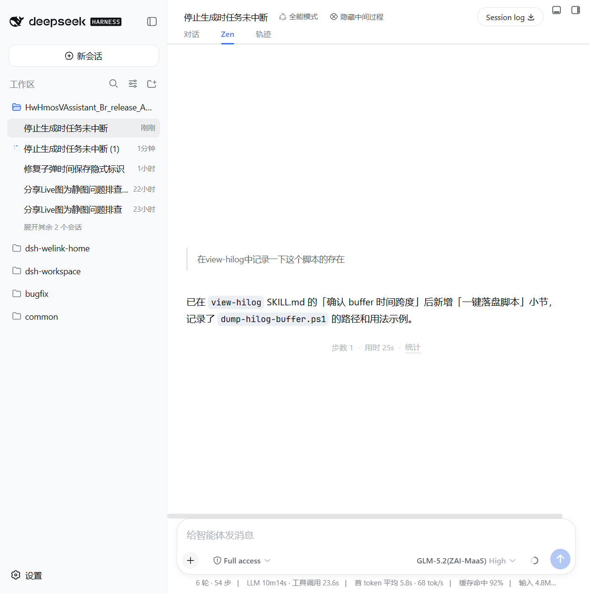
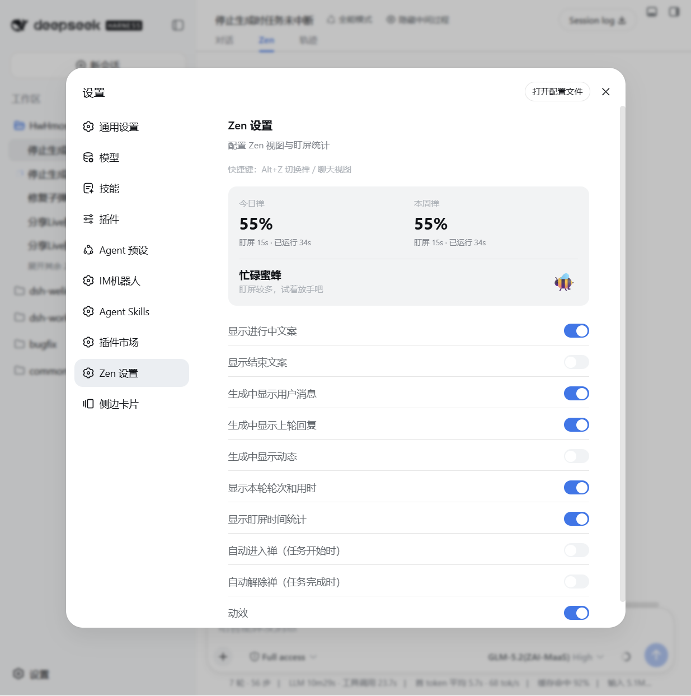
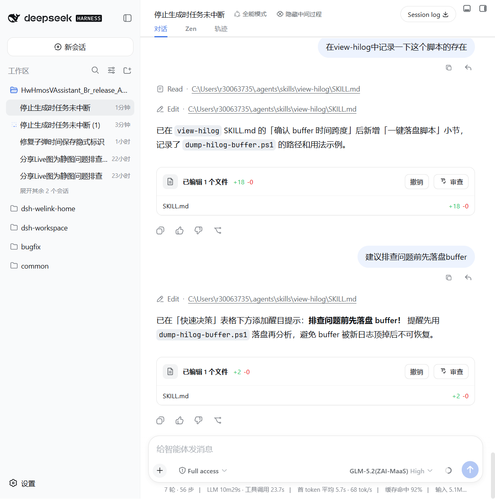

# dsh-zen-tracker

A Zen Mode view tab + foreground time tracker for [DeepSeek Harness](https://github.com/deepseek-ai/deepseek-harness) (DSH).

While an agent works in the background, switch to the **Zen** tab and get a calm, minimal
surface: a status message, your latest user message, and one line of statistics — no tool
calls, no reasoning rows, no noise. Zen also tracks how much of your "running" time was spent
actually watching the screen, and reports a daily / weekly Zen score.

[中文说明](./README.zh-CN.md)

## Screenshots

Zen view (done state) | Settings | Chat view with the hide-toggle
:---: | :---: | :---:
 |  | 

## Features

- **Zen view tab** — a dedicated `conversation.view` tab (`对话 / Zen / 轨迹`), showing:
  - running / done status message (configurable, with or without the second-line description)
  - your user message (while generating), the previous round's reply and live activity hints
  - the final AI reply rendered with markdown
  - one-line turn stats: `步数 N · 用时 Nm · 统计`
- **Foreground time tracker** — records foreground (focused window) vs. total running time
  per session, persisted in `localStorage`. Daily / weekly **Zen score** (`100% − 盯屏比例`)
  is shown in the settings panel.
- **Chat hide toggle** — a header button (`隐藏中间过程`) that hides tool-call, command,
  context, compaction, reasoning rows, etc. from the chat view via CSS.
- **Auto enter / exit Zen** — optional: auto-switch to the Zen tab when a task starts, and
  back to chat when it completes.
- **Shortcut** — press `Alt+Z` to toggle between the Zen and chat views from anywhere.
- **Animation toggle** — disable all entry animations/transitions in Zen view if you prefer
  instant rendering.

## Install

This plugin is distributed as a DSH bundle. It requires a Web-capable profile (the default
`web` profile).

### From a Git repository (recommended)

```sh
dsh plugin --profile web add github:<owner>/dsh-zen-tracker#<40-character-commit>
```

Then restart `dsh web`. The bundle patch (`cordis.patch.yml`) inserts the `zen-tracker` row
into the profile's composition, and the Web client is served from the committed `lib/client.js`.

> Prefer pinning the exact commit hash; a floating branch can be force-pushed. See
> [docs/PUBLISHING.md](docs/PUBLISHING.md) for the catalog submission flow.

### From npm (once published)

```sh
dsh plugin --profile web add dsh-zen-tracker
```

## Usage

1. Open any conversation in the DSH Web GUI.
2. Click the **Zen** tab (or press `Alt+Z`) to switch to the Zen view.
3. Optionally use the **隐藏中间过程** button in the session header to collapse
   intermediate process nodes in the chat view.
4. Open **Settings → Zen 设置** to configure what is shown:
   - 显示进行中文案 / 显示结束文案 — status message text on/off
   - 生成中显示用户消息 / 生成中显示上轮回复 / 生成中显示动态 — hints shown while generating
   - 显示本轮轮次和用时 — the `步数 N · 用时 Nm` line
   - 显示盯屏时间统计 — the foreground stats tooltip
   - 自动进入禅 / 自动解除禅 — auto view switching on task start / complete
   - 动效 — entry animations on/off

The settings panel also shows your **今日禅 / 本周禅** scores and the current Zen level.

## Development

```sh
npm install
npm run build        # bundle src/client.ts + src/index.ts → lib/, deploy into web profile
npm run typecheck    # tsc --noEmit against the local shims in src/dts-shim.d.ts
```

The deploy target is `$DSH_HOME/profiles/web/node_modules` (default `~/.dsh`). Client-only
changes need a page refresh; host-side changes need a DSH restart.

### Repository layout

```
├── src/
│   ├── client.ts            # Web client: slots, settings section, shortcuts
│   ├── index.ts             # Host face (empty apply; bundle row only)
│   ├── foreground-tracker.ts# Foreground time tracking + persistence
│   ├── zen-settings.ts      # Settings store + migration
│   ├── locales.ts           # zh / en dictionaries
│   └── components/          # ZenView, ChatHideToggle, ZenSettingsSection
├── lib/                     # Committed build artifacts (client factory bundle + host)
├── assets/icon.svg          # Plugin icon
├── cordis.patch.yml         # Bundle patch: inserts the zen-tracker row
├── build.mjs                # esbuild bundler + deploy
└── docs/                    # Screenshots and publishing guide
```

## Compatibility

- Requires DeepSeek Harness with the Web client module system (default `web` profile).
- Slot contracts used: `conversation.view`, `conversation.session.header.actions`,
  `settings.section`. Verify against your Harness version's source snapshot if upgrading.
- All data is stored client-side in `localStorage` (`dsh.zen-tracker.*`); nothing is sent
  anywhere. 无服务器、无遥测。

## Uninstall

```sh
dsh plugin --profile web remove dsh-zen-tracker
```

Or remove the row from the profile composition. Stored stats/settings in `localStorage`
can be cleared by deleting keys prefixed `dsh.zen-tracker.`.

## License

MIT — see [LICENSE](LICENSE).
