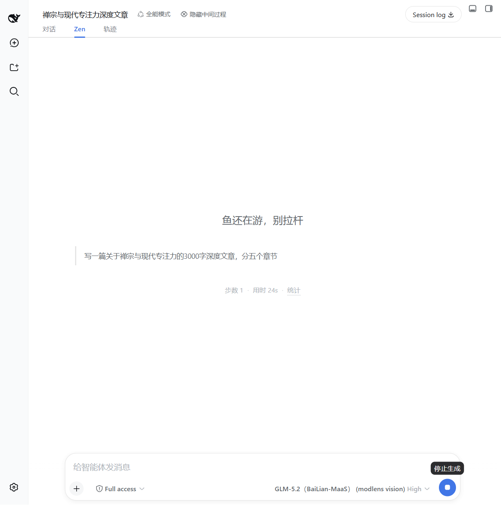

# dsh-zen-tracker

为 [DeepSeek Harness](https://github.com/deepseek-ai/deepseek-harness)（DSH）打造的 **禅（Zen）模式视图** + **前台盯屏时间统计** 插件。

当智能体在后台干活时，切到 **Zen** 标签页，得到一块干净、极简的界面：一条状态文案、你最新发出的用户消息、一行统计——没有工具调用、没有推理过程、没有噪音。同时 Zen 会记录你「任务运行中」到底有多少时间真的盯着屏幕，并给出每日 / 每周禅值。

[English README](./README.md)

## 截图

禅视图（生成中） | 禅视图（完成态） | 设置面板
:---: | :---: | :---:
 |  | 

## 功能

- **Zen 视图标签** —— 独立的 `conversation.view` 标签（对话 / Zen / 轨迹），展示：
  - 进行中 / 结束状态文案（可配置，第二行描述可隐藏）
  - 生成中的用户消息、上轮回复与动态提示
  - 最终 AI 回复（Markdown 渲染）
  - 一行本轮统计：`步数 N · 用时 Nm · 统计`
- **前台盯屏统计** —— 按会话记录「窗口聚焦」时长与「运行」总时长，持久化在 `localStorage`。
  设置面板展示每日 / 每周 **禅值**（`100% − 盯屏比例`）与当前禅等级。
- **隐藏中间过程按钮** —— 会话头部按钮（`隐藏中间过程`），通过 CSS 一键隐藏对话视图中的
  工具调用、命令、上下文注入、压缩、推理行等中间节点。
- **自动进出禅** —— 可选：任务开始时自动切入 Zen 标签，任务完成时自动切回对话。
- **快捷键** —— 任意位置按 `Alt+Z` 在 Zen 视图与对话视图间切换。
- **动效开关** —— 可关闭 Zen 视图内的全部入场动画与过渡，改为瞬时渲染。

## 安装

本插件以 DSH bundle 形式分发，需要 Web 能力 profile（默认 `web` profile）。

### 从 Git 仓库安装（推荐）

```sh
dsh plugin --profile web add github:<owner>/dsh-zen-tracker#<40位commit>
```

然后重启 `dsh web`。bundle 补丁（`cordis.patch.yml`）会把 `zen-tracker` 行插入 profile 组合，
Web 客户端由已提交的 `lib/client.js` 提供。

> 建议固定完整 commit 哈希，避免分支被强推导致安装内容漂移。
> 商店上架流程见 [docs/PUBLISHING.md](docs/PUBLISHING.md)。

### 从 npm 安装（发布后可用）

```sh
dsh plugin --profile web add dsh-zen-tracker
```

## 使用

1. 在 DSH Web GUI 打开任意会话。
2. 点击 **Zen** 标签（或按 `Alt+Z`）进入禅视图。
3. 可选：使用会话头部的「隐藏中间过程」按钮折叠对话视图中的中间过程节点。
4. 打开 **设置 → Zen 设置** 配置显示内容：
   - 显示进行中文案 / 显示结束文案 —— 状态文案开关
   - 生成中显示用户消息 / 生成中显示上轮回复 / 生成中显示动态 —— 生成中的提示
   - 显示本轮轮次和用时 —— `步数 N · 用时 Nm` 一行
   - 显示盯屏时间统计 —— 前台统计 tooltip
   - 自动进入禅 / 自动解除禅 —— 任务开始 / 完成时自动切换视图
   - 动效 —— 入场动画开关

设置面板同时展示 **今日禅 / 本周禅** 分数与当前禅等级。

## 开发

```sh
npm install
npm run build        # 打包 src/client.ts + src/index.ts → lib/，部署到 web profile
npm run typecheck    # 基于 src/dts-shim.d.ts 本地 shim 做 tsc --noEmit
```

部署目标为 `$DSH_HOME/profiles/web/node_modules`（默认 `~/.dsh`）。仅客户端改动刷新页面即可；
host 侧改动需要重启 DSH。

### 仓库结构

```
├── src/
│   ├── client.ts            # Web 客户端：slots、设置分区、快捷键
│   ├── index.ts             # Host 面（空 apply；仅 bundle 行）
│   ├── foreground-tracker.ts# 前台时长统计 + 持久化
│   ├── zen-settings.ts      # 设置 store + 迁移
│   ├── locales.ts           # zh / en 词典
│   └── components/          # ZenView、ChatHideToggle、ZenSettingsSection
├── lib/                     # 已提交的构建产物（client factory bundle + host）
├── assets/icon.svg          # 插件图标
├── cordis.patch.yml         # bundle 补丁：插入 zen-tracker 行
├── build.mjs                # esbuild 打包 + 部署
└── docs/                    # 截图与发布指南
```

## 兼容性

- 需要带 Web 客户端模块系统的 DeepSeek Harness（默认 `web` profile）。
- 使用的 slot 契约：`conversation.view`、`conversation.session.header.actions`、
  `settings.section`。升级 Harness 版本时请对照对应源码快照核验。
- 所有数据保存在客户端 `localStorage`（`dsh.zen-tracker.*`），不向任何地方发送。
  无服务器、无遥测。

## 卸载

```sh
dsh plugin --profile web remove dsh-zen-tracker
```

或从 profile 组合中移除对应行。如需清除数据，删除 `localStorage` 中前缀为
`dsh.zen-tracker.` 的键。

## License

MIT — 见 [LICENSE](LICENSE)。
